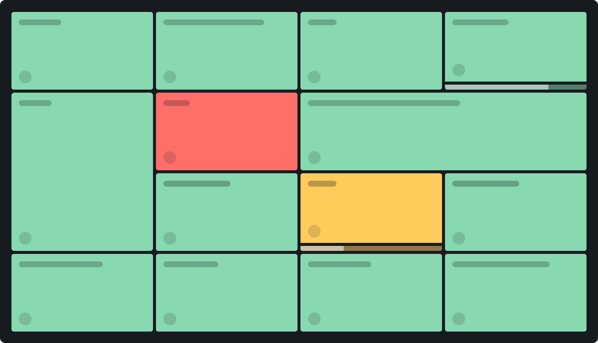

  

  
  
  
   
  
  

-----

# Monitoror

Monitoror is a wallboard monitoring app to monitor server status; monitor CI builds progress or even display critical values.

## Demo

  <a href="https://demo.monitoror.com">
      
    Visit Monitoror live demo
  </a>

## Getting started

Monitoror is a single file app written in Go which can be run on these platforms:

- Linux (64bits, ARM)
- macOS
- Windows (64bits)

The app is divided into two parts: Core and UI.

Core is the server-side Monitoror HTTP API, configured by the environment variables or `.env` file.

UI is the client-side Monitoror loaded in browser, which is the wallboard itself.

[Visit the Monitoror website for more details](https://monitoror.com)

## Documentation

All details about [**installation**](https://monitoror.com/documentation/#installation) and [**configuration**](https://monitoror.com/documentation/#configuration) are on [our documentation](https://monitoror.com/documentation/)

## Development

See our [development guide](https://monitoror.com/guides/#development)

## Authors

<table>
<tbody>
  <tr width="100%">
    <td align="center" width="50%">
      <a href="https://github.com/jsdidierlaurent">
         
        @jsdidierlaurent
      </a>  
      <strong>Jean-Sébastien Didierlaurent</strong> 
      <em>Mostly on Monitoror Core</em> 
      &bull; &bull; &bull; 
      https://twitter.com/Akhiro
    </td>
    <td align="center" width="50%">
      <a href="https://github.com/Alex-D">
         
        @Alex-D
      </a>  
      <strong>Alexandre Demode</strong> 
      <em>Mostly on Monitoror UI</em> 
      &bull; &bull; &bull; 
      https://twitter.com/AlexandreDemode
    </td>
  </tr>
</tbody>
</table>

## Support us

You can support Monitoror ongoing development by doing a donation or being a backer or a sponsor:

## License

This project is licensed under the MIT License - see [the LICENSE file](LICENSE) for details.
